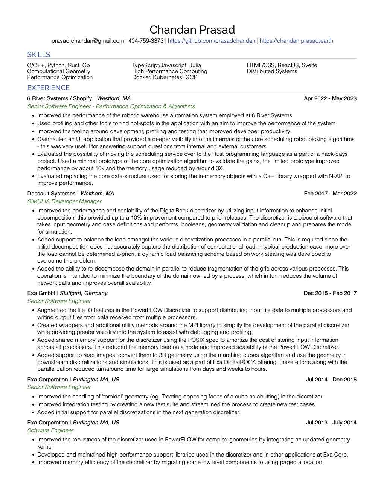
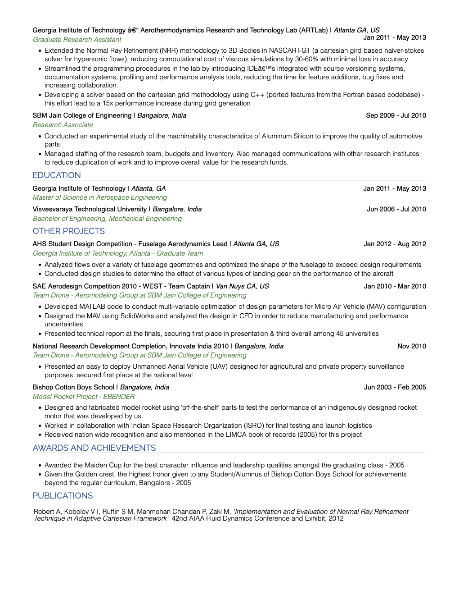

# Repository containing the resume of Chandan Prasad M

Hi and welcome to my resume repository!

I am Chandan Prasad, a full-stack developer with about 10 years of experience working in the software industry, my core competencies are in: 

- Programming languages: 
   + C/C++
   + Python
   + Rust
   + Golang
   + TypeScript
   + Julia
   + HTML/CSS
- Distributed and High Performance Computing
- Performance Optimization
- Numerical Methods and Computational Fluid Dynamics Simulations
- Computational Geometry and associated algorithms
- I am also comfortable working with frontend code, and I have used the following frameworks: 
   + ReactJS
   + Svelte

I enjoy working on complex problems and trying to solve them in the simplest possible way. My educational background is in Mechanical and Aerospace Engineering - but I have realized that my true passion lies in computer science, all aspects of the field are fascinating to me. 

This repository contains the markdown code, css pages, README and a PDF of my resume. The resume is also hosted using GitHub Pages and can be viewed at [https://chandan.prasad.earth](https://chandan.prasad.earth). 

Please feel free to fork this repository and adapt it to your own resume if you like the presentation. 

**I am currently looking for work, if you think my profile is a good fit - Please do reach out at the contact details provided in the links above!**

## Resume

## Features

1. Responsive
2. Print from browser uses a more compact design to reduce number of pages

## Requirements 

1. Using Terminal:
   1. Pandoc (on macOS `brew install pandoc` to install with Homebrew)
   2. BasicTex (on macOS `brew install --cask basictex` to install with Homebrew)
   3. `make pdf` 
2. Using VSCode: 
   1. Install - https://marketplace.visualstudio.com/items?itemName=yzhang.markdown-all-in-one
   2. Markdown Preview to view the the rendered view
   3. `Ctrl + Shift + P` - Print Current Document to HTML

## Known Issues 

1. Export to PDF in Makefile does not work as expected yet
2. The detail expand icon does not change on collapse
3. Save to PDF needs further modifications to reduce number of pages
   
## Credits and References

1. The stylesheet used in this repository was derived from the version cereated by [Teng-Jui Lin](https://github.com/tengjuilin/markdown-resume/blob/main/source/resume.css)
2. Heading text effect derived from the implementation presented by [Hyperplexed](https://www.youtube.com/watch?v=W5oawMJaXbU)

